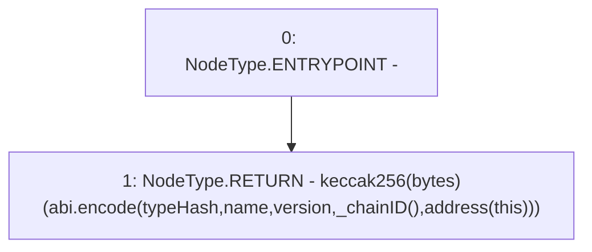

# Context: YUSDToken._buildDomainSeparator

**Contract:** `YUSDToken` (Inherits: IYUSDToken, IERC2612, IERC20, CheckContract)
**Signature:** `_buildDomainSeparator(bytes32,bytes32,bytes32) returns (bytes32)`
**Method Selector ID:** `Internal (No Method ID)`
**Visibility:** `private`
**Environment-Free:** `Yes`
**Modifiers:** None

### State Variables Interaction
- **Reads:** None
- **Writes:** None

### Environment & Verification Flags
- **Uses Foundry Cheatcodes:** No
- **Has Echidna Properties:** No

### Internal Calls Tree
- None

### External Calls / Value Transfers
- None

### Control Flow Graph (CFG)


### Source Mapping
Declared in: `certora-ac-datasets/detasets/web3bugs/dataset/web3bugs/66/packages/contracts/contracts/YUSDToken.sol` on lines **221** to **223**

```solidity
    function _buildDomainSeparator(bytes32 typeHash, bytes32 name, bytes32 version) private view returns (bytes32) {
        return keccak256(abi.encode(typeHash, name, version, _chainID(), address(this)));
    }

```
