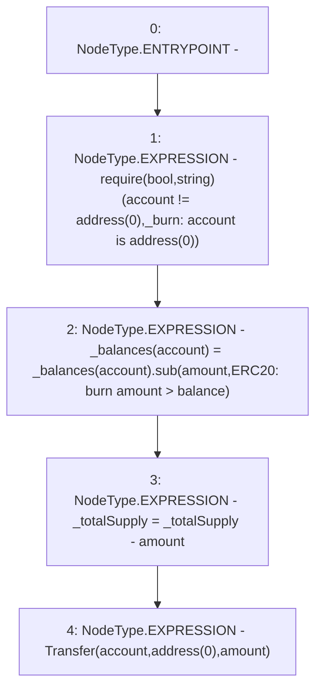

# Context: YUSDToken._burn

**Contract:** `YUSDToken` (Inherits: IYUSDToken, IERC2612, IERC20, CheckContract)
**Signature:** `_burn(address,uint256)`
**Method Selector ID:** `Internal (No Method ID)`
**Visibility:** `internal`
**Environment-Free:** `Yes`
**Modifiers:** None

### State Variables Interaction
- **Reads:** _balances, _totalSupply
- **Writes:** _balances, _totalSupply

### Assertion Checks & Business Requirements
- require/assert: `require(bool,string)(account != address(0),_burn: account is address(0))`

### Environment & Verification Flags
- **Uses Foundry Cheatcodes:** No
- **Has Echidna Properties:** No

### Internal Calls Tree
- None

### External Calls / Value Transfers
- `SafeMath.TMP_107(uint256) = LIBRARY_CALL, dest:SafeMath, function:SafeMath.sub(uint256,uint256,string), arguments:['REF_29', 'amount', 'ERC20: burn amount > balance'] `

### Control Flow Graph (CFG)


### Source Mapping
Declared in: `certora-ac-datasets/detasets/web3bugs/dataset/web3bugs/66/packages/contracts/contracts/YUSDToken.sol` on lines **245** to **251**

```solidity
    function _burn(address account, uint256 amount) internal {
        require(account != address(0), "_burn: account is address(0)");
        
        _balances[account] = _balances[account].sub(amount, "ERC20: burn amount > balance");
        _totalSupply = _totalSupply - amount; // can't underflow since indiv balance didn't
        emit Transfer(account, address(0), amount);
    }

```
