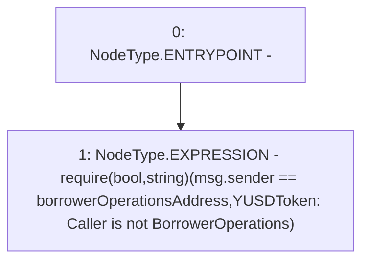

# Context: YUSDToken._requireCallerIsBorrowerOperations

**Contract:** `YUSDToken` (Inherits: IYUSDToken, IERC2612, IERC20, CheckContract)
**Signature:** `_requireCallerIsBorrowerOperations()`
**Method Selector ID:** `Internal (No Method ID)`
**Visibility:** `internal`
**Environment-Free:** `No (reads EVM state context)`
**Modifiers:** None

### State Variables Interaction
- **Reads:** borrowerOperationsAddress
- **Writes:** None

### Assertion Checks & Business Requirements
- require/assert: `require(bool,string)(msg.sender == borrowerOperationsAddress,YUSDToken: Caller is not BorrowerOperations)`

### Environment & Verification Flags
- **Uses Foundry Cheatcodes:** No
- **Has Echidna Properties:** No

### Internal Calls Tree
- None

### External Calls / Value Transfers
- None

### Control Flow Graph (CFG)


### Source Mapping
Declared in: `certora-ac-datasets/detasets/web3bugs/dataset/web3bugs/66/packages/contracts/contracts/YUSDToken.sol` on lines **279** to **281**

```solidity
    function _requireCallerIsBorrowerOperations() internal view {
        require(msg.sender == borrowerOperationsAddress, "YUSDToken: Caller is not BorrowerOperations");
    }

```
