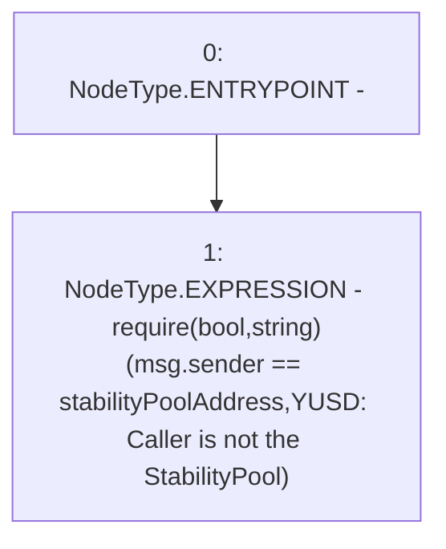

# Context: YUSDToken._requireCallerIsStabilityPool

**Contract:** `YUSDToken` (Inherits: IYUSDToken, IERC2612, IERC20, CheckContract)
**Signature:** `_requireCallerIsStabilityPool()`
**Method Selector ID:** `Internal (No Method ID)`
**Visibility:** `internal`
**Environment-Free:** `No (reads EVM state context)`
**Modifiers:** None

### State Variables Interaction
- **Reads:** stabilityPoolAddress
- **Writes:** None

### Assertion Checks & Business Requirements
- require/assert: `require(bool,string)(msg.sender == stabilityPoolAddress,YUSD: Caller is not the StabilityPool)`

### Environment & Verification Flags
- **Uses Foundry Cheatcodes:** No
- **Has Echidna Properties:** No

### Internal Calls Tree
- None

### External Calls / Value Transfers
- None

### Control Flow Graph (CFG)


### Source Mapping
Declared in: `certora-ac-datasets/detasets/web3bugs/dataset/web3bugs/66/packages/contracts/contracts/YUSDToken.sol` on lines **293** to **295**

```solidity
    function _requireCallerIsStabilityPool() internal view {
        require(msg.sender == stabilityPoolAddress, "YUSD: Caller is not the StabilityPool");
    }

```
