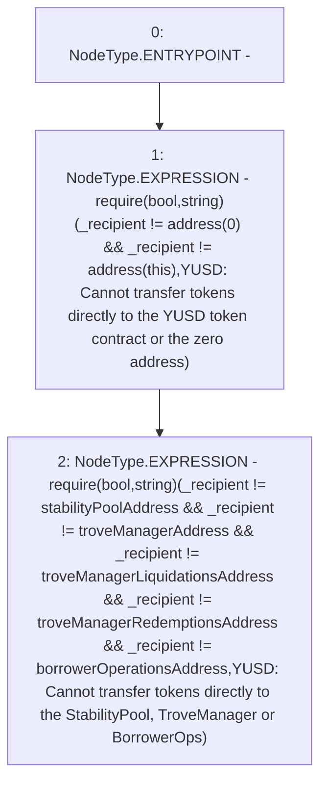

# Context: YUSDToken._requireValidRecipient

**Contract:** `YUSDToken` (Inherits: IYUSDToken, IERC2612, IERC20, CheckContract)
**Signature:** `_requireValidRecipient(address)`
**Method Selector ID:** `Internal (No Method ID)`
**Visibility:** `internal`
**Environment-Free:** `Yes`
**Modifiers:** None

### State Variables Interaction
- **Reads:** borrowerOperationsAddress, stabilityPoolAddress, troveManagerAddress, troveManagerLiquidationsAddress, troveManagerRedemptionsAddress
- **Writes:** None

### Assertion Checks & Business Requirements
- require/assert: `require(bool,string)(_recipient != address(0) && _recipient != address(this),YUSD: Cannot transfer tokens directly to the YUSD token contract or the zero address)`
- require/assert: `require(bool,string)(_recipient != stabilityPoolAddress && _recipient != troveManagerAddress && _recipient != troveManagerLiquidationsAddress && _recipient != troveManagerRedemptionsAddress && _recipient != borrowerOperationsAddress,YUSD: Cannot transfer tokens directly to the StabilityPool, TroveManager or BorrowerOps)`

### Environment & Verification Flags
- **Uses Foundry Cheatcodes:** No
- **Has Echidna Properties:** No

### Internal Calls Tree
- None

### External Calls / Value Transfers
- `TMP_123(None) = SOLIDITY_CALL require(bool,string)(TMP_122,YUSD: Cannot transfer tokens directly to the YUSD token contract or the zero address)`
- `TMP_133(None) = SOLIDITY_CALL require(bool,string)(TMP_132,YUSD: Cannot transfer tokens directly to the StabilityPool, TroveManager or BorrowerOps)`

### Control Flow Graph (CFG)


### Source Mapping
Declared in: `certora-ac-datasets/detasets/web3bugs/dataset/web3bugs/66/packages/contracts/contracts/YUSDToken.sol` on lines **263** to **277**

```solidity
    function _requireValidRecipient(address _recipient) internal view {
        require(
            _recipient != address(0) && 
            _recipient != address(this),
            "YUSD: Cannot transfer tokens directly to the YUSD token contract or the zero address"
        );
        require(
            _recipient != stabilityPoolAddress && 
            _recipient != troveManagerAddress &&
            _recipient != troveManagerLiquidationsAddress && 
            _recipient != troveManagerRedemptionsAddress && 
            _recipient != borrowerOperationsAddress, 
            "YUSD: Cannot transfer tokens directly to the StabilityPool, TroveManager or BorrowerOps"
        );
    }

```
