# Context: YUSDToken.constructor

**Contract:** `YUSDToken` (Inherits: IYUSDToken, IERC2612, IERC20, CheckContract)
**Signature:** `constructor(address,address,address,address,address)`
**Method Selector ID:** `0x5607425a`
**Visibility:** `public`
**Environment-Free:** `Yes`
**Modifiers:** None

### State Variables Interaction
- **Reads:** _NAME, _TYPE_HASH, _VERSION
- **Writes:** _CACHED_CHAIN_ID, _CACHED_DOMAIN_SEPARATOR, _HASHED_NAME, _HASHED_VERSION, borrowerOperationsAddress, stabilityPoolAddress, troveManagerAddress, troveManagerLiquidationsAddress, troveManagerRedemptionsAddress

### Environment & Verification Flags
- **Uses Foundry Cheatcodes:** No
- **Has Echidna Properties:** No

### Internal Calls Tree
- None

### External Calls / Value Transfers
- None

### Control Flow Graph (CFG)

```mermaid
flowchart TD
    Node_0["0: NodeType.ENTRYPOINT - "]
    Node_0 --> Node_1
    Node_1["1: NodeType.EXPRESSION - checkContract(_troveManagerAddress)"]
    Node_1 --> Node_2
    Node_2["2: NodeType.EXPRESSION - checkContract(_troveManagerLiquidationsAddress)"]
    Node_2 --> Node_3
    Node_3["3: NodeType.EXPRESSION - checkContract(_troveManagerRedemptionsAddress)"]
    Node_3 --> Node_4
    Node_4["4: NodeType.EXPRESSION - checkContract(_stabilityPoolAddress)"]
    Node_4 --> Node_5
    Node_5["5: NodeType.EXPRESSION - checkContract(_borrowerOperationsAddress)"]
    Node_5 --> Node_6
    Node_6["6: NodeType.EXPRESSION - troveManagerAddress = _troveManagerAddress"]
    Node_6 --> Node_7
    Node_7["7: NodeType.EXPRESSION - TroveManagerAddressChanged(_troveManagerAddress)"]
    Node_7 --> Node_8
    Node_8["8: NodeType.EXPRESSION - troveManagerLiquidationsAddress = _troveManagerLiquidationsAddress"]
    Node_8 --> Node_9
    Node_9["9: NodeType.EXPRESSION - TroveManagerLiquidatorAddressChanged(_troveManagerLiquidationsAddress)"]
    Node_9 --> Node_10
    Node_10["10: NodeType.EXPRESSION - troveManagerRedemptionsAddress = _troveManagerRedemptionsAddress"]
    Node_10 --> Node_11
    Node_11["11: NodeType.EXPRESSION - TroveManagerRedemptionsAddressChanged(_troveManagerRedemptionsAddress)"]
    Node_11 --> Node_12
    Node_12["12: NodeType.EXPRESSION - stabilityPoolAddress = _stabilityPoolAddress"]
    Node_12 --> Node_13
    Node_13["13: NodeType.EXPRESSION - StabilityPoolAddressChanged(_stabilityPoolAddress)"]
    Node_13 --> Node_14
    Node_14["14: NodeType.EXPRESSION - borrowerOperationsAddress = _borrowerOperationsAddress"]
    Node_14 --> Node_15
    Node_15["15: NodeType.EXPRESSION - BorrowerOperationsAddressChanged(_borrowerOperationsAddress)"]
    Node_15 --> Node_16
    Node_16["16: NodeType.VARIABLE - hashedName = keccak256(bytes)(bytes(_NAME))"]
    Node_16 --> Node_17
    Node_17["17: NodeType.VARIABLE - hashedVersion = keccak256(bytes)(bytes(_VERSION))"]
    Node_17 --> Node_18
    Node_18["18: NodeType.EXPRESSION - _HASHED_NAME = hashedName"]
    Node_18 --> Node_19
    Node_19["19: NodeType.EXPRESSION - _HASHED_VERSION = hashedVersion"]
    Node_19 --> Node_20
    Node_20["20: NodeType.EXPRESSION - _CACHED_CHAIN_ID = _chainID()"]
    Node_20 --> Node_21
    Node_21["21: NodeType.EXPRESSION - _CACHED_DOMAIN_SEPARATOR = _buildDomainSeparator(_TYPE_HASH,hashedName,hashedVersion)"]
```


### Source Mapping
Declared in: `certora-ac-datasets/detasets/web3bugs/dataset/web3bugs/66/packages/contracts/contracts/YUSDToken.sol` on lines **71** to **109**

```solidity
    constructor
    (
        address _troveManagerAddress,
        address _troveManagerLiquidationsAddress,
        address _troveManagerRedemptionsAddress,
        address _stabilityPoolAddress,
        address _borrowerOperationsAddress
    ) 
        public 
    {
        checkContract(_troveManagerAddress);
        checkContract(_troveManagerLiquidationsAddress);
        checkContract(_troveManagerRedemptionsAddress);
        checkContract(_stabilityPoolAddress);
        checkContract(_borrowerOperationsAddress);

        troveManagerAddress = _troveManagerAddress;
        emit TroveManagerAddressChanged(_troveManagerAddress);

        troveManagerLiquidationsAddress = _troveManagerLiquidationsAddress;
        emit TroveManagerLiquidatorAddressChanged(_troveManagerLiquidationsAddress);

        troveManagerRedemptionsAddress = _troveManagerRedemptionsAddress;
        emit TroveManagerRedemptionsAddressChanged(_troveManagerRedemptionsAddress);

        stabilityPoolAddress = _stabilityPoolAddress;
        emit StabilityPoolAddressChanged(_stabilityPoolAddress);

        borrowerOperationsAddress = _borrowerOperationsAddress;        
        emit BorrowerOperationsAddressChanged(_borrowerOperationsAddress);
        
        bytes32 hashedName = keccak256(bytes(_NAME));
        bytes32 hashedVersion = keccak256(bytes(_VERSION));
        
        _HASHED_NAME = hashedName;
        _HASHED_VERSION = hashedVersion;
        _CACHED_CHAIN_ID = _chainID();
        _CACHED_DOMAIN_SEPARATOR = _buildDomainSeparator(_TYPE_HASH, hashedName, hashedVersion);
    }

```
