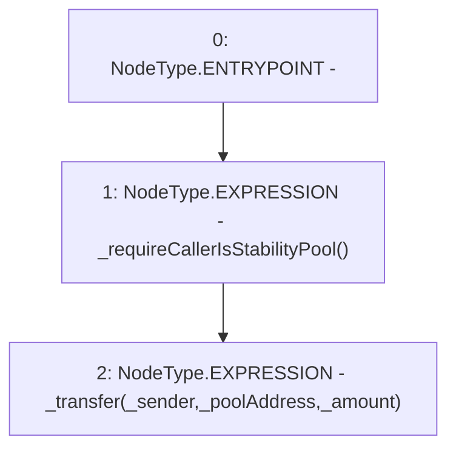

# Context: YUSDToken.sendToPool

**Contract:** `YUSDToken` (Inherits: IYUSDToken, IERC2612, IERC20, CheckContract)
**Signature:** `sendToPool(address,address,uint256)`
**Method Selector ID:** `0xbb997bac`
**Visibility:** `external`
**Environment-Free:** `No (reads EVM state context)`
**Modifiers:** None

### State Variables Interaction
- **Reads:** None
- **Writes:** None

### Environment & Verification Flags
- **Uses Foundry Cheatcodes:** No
- **Has Echidna Properties:** No

### Internal Calls Tree
- None

### External Calls / Value Transfers
- None

### Control Flow Graph (CFG)


### Source Mapping
Declared in: `certora-ac-datasets/detasets/web3bugs/dataset/web3bugs/66/packages/contracts/contracts/YUSDToken.sol` on lines **123** to **126**

```solidity
    function sendToPool(address _sender,  address _poolAddress, uint256 _amount) external override {
        _requireCallerIsStabilityPool();
        _transfer(_sender, _poolAddress, _amount);
    }

```
