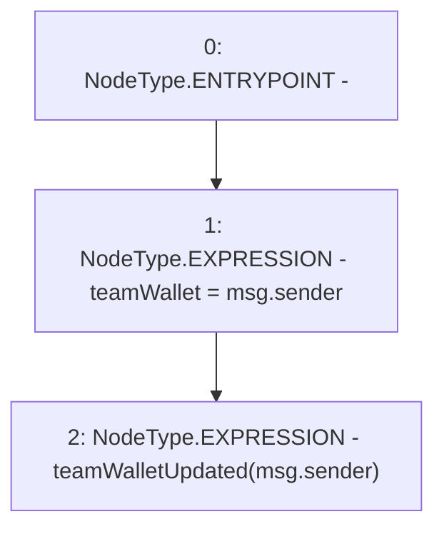

# Context: YetiFinanceTreasury.constructor

**Contract:** `YetiFinanceTreasury` (Inherits: None)
**Signature:** `constructor()`
**Method Selector ID:** `0x90fa17bb`
**Visibility:** `public`
**Environment-Free:** `No (reads EVM state context)`
**Modifiers:** None

### State Variables Interaction
- **Reads:** None
- **Writes:** teamWallet

### Environment & Verification Flags
- **Uses Foundry Cheatcodes:** No
- **Has Echidna Properties:** No

### Internal Calls Tree
- None

### External Calls / Value Transfers
- None

### Control Flow Graph (CFG)


### Source Mapping
Declared in: `certora-ac-datasets/detasets/web3bugs/dataset/web3bugs/66/packages/contracts/contracts/YetiFinanceTreasury.sol` on lines **19** to **22**

```solidity
    constructor() public {
        teamWallet = msg.sender;
        emit teamWalletUpdated(msg.sender);
    }

```
