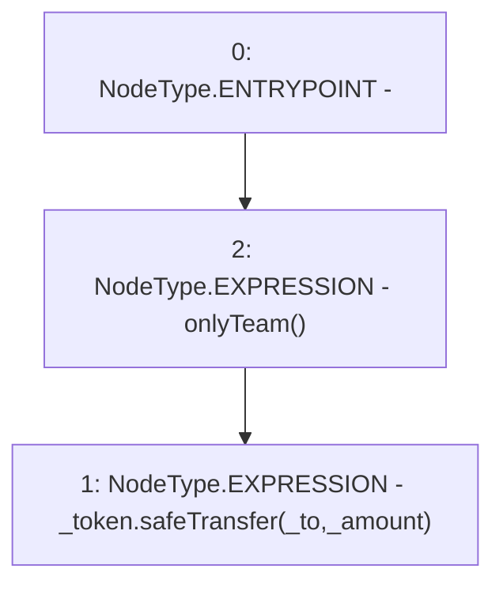

# Context: YetiFinanceTreasury.sendToken

**Contract:** `YetiFinanceTreasury` (Inherits: None)
**Signature:** `sendToken(IERC20,address,uint256)`
**Method Selector ID:** `0x2fdcfbd2`
**Visibility:** `external`
**Environment-Free:** `No (reads EVM state context)`
**Modifiers:**
- `onlyTeam`
  ```solidity
  modifier onlyTeam() {
          require(msg.sender == teamWallet, "Treasury : Not Team Sender");
          _;
      }
  ```

### State Variables Interaction
- **Reads:** None
- **Writes:** None

### Environment & Verification Flags
- **Uses Foundry Cheatcodes:** No
- **Has Echidna Properties:** No

### Internal Calls Tree
- None

### External Calls / Value Transfers
- `SafeERC20.LIBRARY_CALL, dest:SafeERC20, function:SafeERC20.safeTransfer(IERC20,address,uint256), arguments:['_token', '_to', '_amount'] `

### Control Flow Graph (CFG)


### Source Mapping
Declared in: `certora-ac-datasets/detasets/web3bugs/dataset/web3bugs/66/packages/contracts/contracts/YetiFinanceTreasury.sol` on lines **29** to **31**

```solidity
    function sendToken(IERC20 _token, address _to, uint _amount) external onlyTeam {
        _token.safeTransfer(_to, _amount);
    }

```
