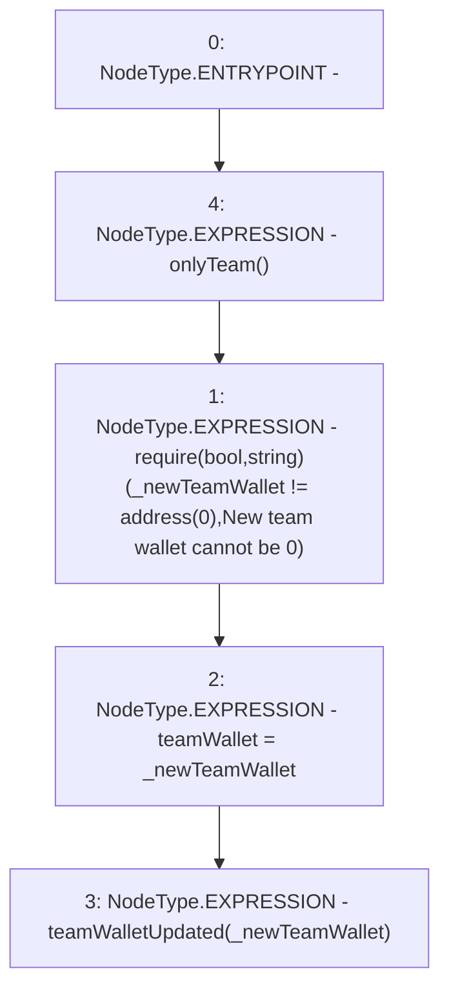

# Context: YetiFinanceTreasury.updateTeamWallet

**Contract:** `YetiFinanceTreasury` (Inherits: None)
**Signature:** `updateTeamWallet(address)`
**Method Selector ID:** `0x7cb332bb`
**Visibility:** `external`
**Environment-Free:** `No (reads EVM state context)`
**Modifiers:**
- `onlyTeam`
  ```solidity
  modifier onlyTeam() {
          require(msg.sender == teamWallet, "Treasury : Not Team Sender");
          _;
      }
  ```

### State Variables Interaction
- **Reads:** None
- **Writes:** teamWallet

### Assertion Checks & Business Requirements
- require/assert: `require(bool,string)(_newTeamWallet != address(0),New team wallet cannot be 0)`

### Environment & Verification Flags
- **Uses Foundry Cheatcodes:** No
- **Has Echidna Properties:** No

### Internal Calls Tree
- None

### External Calls / Value Transfers
- None

### Control Flow Graph (CFG)


### Source Mapping
Declared in: `certora-ac-datasets/detasets/web3bugs/dataset/web3bugs/66/packages/contracts/contracts/YetiFinanceTreasury.sol` on lines **33** to **37**

```solidity
    function updateTeamWallet(address _newTeamWallet) external onlyTeam {
        require(_newTeamWallet != address(0), "New team wallet cannot be 0");
        teamWallet = _newTeamWallet;
        emit teamWalletUpdated(_newTeamWallet);
    }

```
