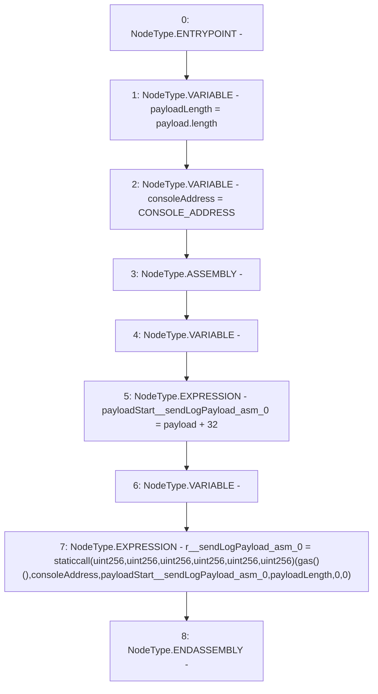

# Context: console._sendLogPayload

**Contract:** `console` (Inherits: None)
**Signature:** `_sendLogPayload(bytes)`
**Method Selector ID:** `Internal (No Method ID)`
**Visibility:** `private`
**Environment-Free:** `Yes`
**Modifiers:** None

### State Variables Interaction
- **Reads:** CONSOLE_ADDRESS
- **Writes:** None

### Environment & Verification Flags
- **Uses Foundry Cheatcodes:** No
- **Has Echidna Properties:** No

### Internal Calls Tree
- None

### External Calls / Value Transfers
- `TMP_2(uint256) = SOLIDITY_CALL staticcall(uint256,uint256,uint256,uint256,uint256,uint256)(TMP_1,consoleAddress,payloadStart__sendLogPayload_asm_0,payloadLength,0,0)`

### Control Flow Graph (CFG)


### Source Mapping
Declared in: `certora-ac-datasets/detasets/web3bugs/dataset/web3bugs/66/node_modules/hardhat/console.sol` on lines **7** to **14**

```solidity
	function _sendLogPayload(bytes memory payload) private view {
		uint256 payloadLength = payload.length;
		address consoleAddress = CONSOLE_ADDRESS;
		assembly {
			let payloadStart := add(payload, 32)
			let r := staticcall(gas(), consoleAddress, payloadStart, payloadLength, 0, 0)
		}
	}

```
