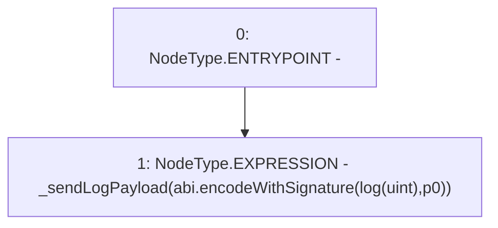

# Context: console.logUint

**Contract:** `console` (Inherits: None)
**Signature:** `logUint(uint256)`
**Method Selector ID:** `Internal (No Method ID)`
**Visibility:** `internal`
**Environment-Free:** `Yes`
**Modifiers:** None

### State Variables Interaction
- **Reads:** None
- **Writes:** None

### Environment & Verification Flags
- **Uses Foundry Cheatcodes:** No
- **Has Echidna Properties:** No

### Internal Calls Tree
- None

### External Calls / Value Transfers
- None

### Control Flow Graph (CFG)


### Source Mapping
Declared in: `certora-ac-datasets/detasets/web3bugs/dataset/web3bugs/66/node_modules/hardhat/console.sol` on lines **24** to **26**

```solidity
	function logUint(uint p0) internal view {
		_sendLogPayload(abi.encodeWithSignature("log(uint)", p0));
	}

```
