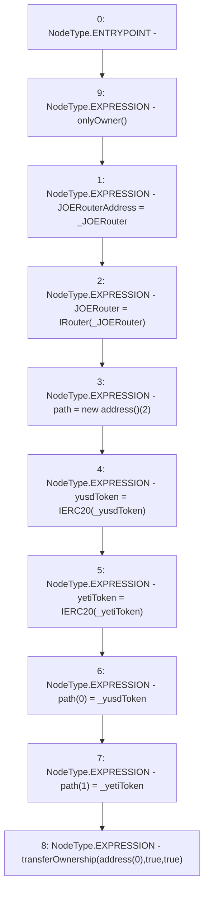

# Context: dummyUniV2Router.setup

**Contract:** `dummyUniV2Router` (Inherits: BoringOwnable, BoringOwnableData, IsYETIRouter)
**Signature:** `setup(address,address,address)`
**Method Selector ID:** `0x77b8b1c7`
**Visibility:** `external`
**Environment-Free:** `No (reads EVM state context)`
**Modifiers:**
- `onlyOwner`
  ```solidity
  modifier onlyOwner() {
          require(msg.sender == owner, "Ownable: caller is not the owner");
          _;
      }
  ```

### State Variables Interaction
- **Reads:** None
- **Writes:** JOERouter, JOERouterAddress, path, yetiToken, yusdToken

### Environment & Verification Flags
- **Uses Foundry Cheatcodes:** No
- **Has Echidna Properties:** No

### Internal Calls Tree
- None

### External Calls / Value Transfers
- None

### Control Flow Graph (CFG)


### Source Mapping
Declared in: `certora-ac-datasets/detasets/web3bugs/dataset/web3bugs/66/packages/contracts/contracts/YETI/YUSDToYETIRouters/dummyUniV2Router.sol` on lines **17** to **27**

```solidity
    function setup(address _JOERouter, address _yusdToken, address _yetiToken) external onlyOwner {
        JOERouterAddress = _JOERouter;
        JOERouter = IRouter(_JOERouter);
        path = new address[](2);
        yusdToken = IERC20(_yusdToken);
        yetiToken = IERC20(_yetiToken);
        path[0] = _yusdToken;
        path[1] = _yetiToken;
        // Renounce ownership
        transferOwnership(address(0), true, true);
    }

```
