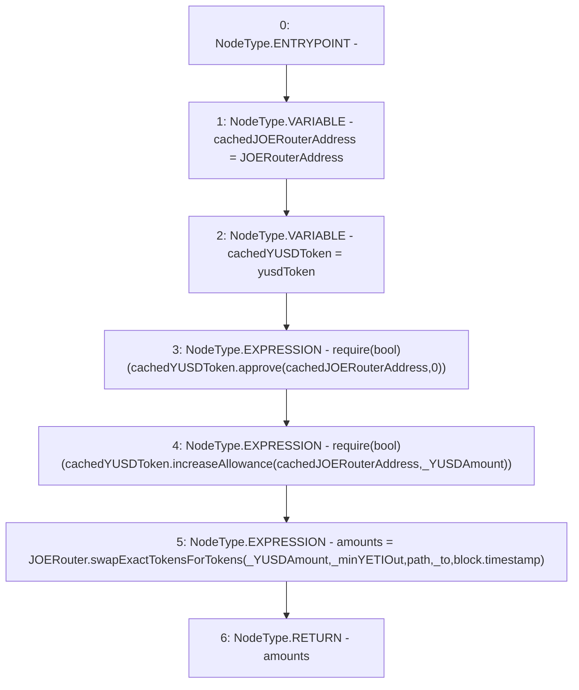

# Context: dummyUniV2Router.swap

**Contract:** `dummyUniV2Router` (Inherits: BoringOwnable, BoringOwnableData, IsYETIRouter)
**Signature:** `swap(uint256,uint256,address) returns (uint256[])`
**Method Selector ID:** `0x6d9a640a`
**Visibility:** `external`
**Environment-Free:** `No (reads EVM state context)`
**Modifiers:** None

### State Variables Interaction
- **Reads:** JOERouter, JOERouterAddress, path, yusdToken
- **Writes:** None

### Assertion Checks & Business Requirements
- require/assert: `require(bool)(cachedYUSDToken.approve(cachedJOERouterAddress,0))`
- require/assert: `require(bool)(cachedYUSDToken.increaseAllowance(cachedJOERouterAddress,_YUSDAmount))`

### Environment & Verification Flags
- **Uses Foundry Cheatcodes:** No
- **Has Echidna Properties:** No

### Internal Calls Tree
- None

### External Calls / Value Transfers
- `IRouter.TMP_40(uint256[]) = HIGH_LEVEL_CALL, dest:JOERouter(IRouter), function:swapExactTokensForTokens, arguments:['_YUSDAmount', '_minYETIOut', 'path', '_to', 'block.timestamp']  `
- `IERC20.TMP_36(bool) = HIGH_LEVEL_CALL, dest:cachedYUSDToken(IERC20), function:approve, arguments:['cachedJOERouterAddress', '0']  `
- `IERC20.TMP_38(bool) = HIGH_LEVEL_CALL, dest:cachedYUSDToken(IERC20), function:increaseAllowance, arguments:['cachedJOERouterAddress', '_YUSDAmount']  `

### Control Flow Graph (CFG)


### Source Mapping
Declared in: `certora-ac-datasets/detasets/web3bugs/dataset/web3bugs/66/packages/contracts/contracts/YETI/YUSDToYETIRouters/dummyUniV2Router.sol` on lines **29** to **35**

```solidity
    function swap(uint256 _YUSDAmount, uint256 _minYETIOut, address _to) external override returns (uint256[] memory amounts) {
        address cachedJOERouterAddress = JOERouterAddress;
        IERC20 cachedYUSDToken = yusdToken;
        require(cachedYUSDToken.approve(cachedJOERouterAddress, 0));
        require(cachedYUSDToken.increaseAllowance(cachedJOERouterAddress, _YUSDAmount));
        amounts = JOERouter.swapExactTokensForTokens(_YUSDAmount, _minYETIOut, path, _to, block.timestamp);
    }

```
