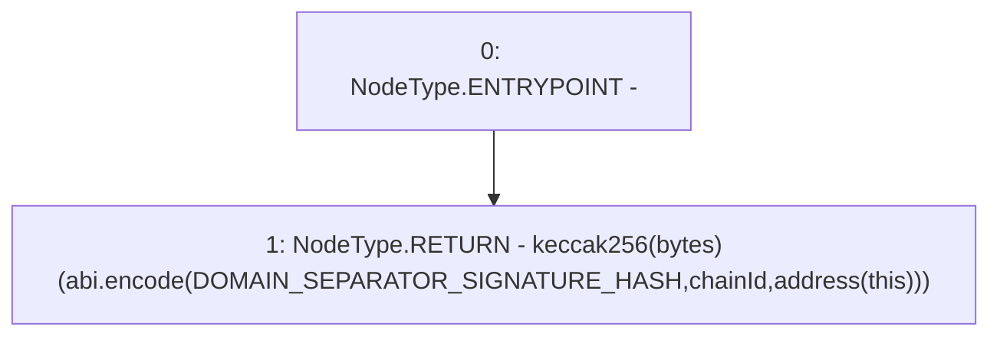

# Context: sYETITokenTester._calculateDomainSeparator

**Contract:** `sYETITokenTester` (Inherits: sYETIToken, BoringOwnable, BoringOwnableData, Domain, IERC20)
**Signature:** `_calculateDomainSeparator(uint256) returns (bytes32)`
**Method Selector ID:** `Internal (No Method ID)`
**Visibility:** `private`
**Environment-Free:** `Yes`
**Modifiers:** None

### State Variables Interaction
- **Reads:** DOMAIN_SEPARATOR_SIGNATURE_HASH
- **Writes:** None

### Environment & Verification Flags
- **Uses Foundry Cheatcodes:** No
- **Has Echidna Properties:** No

### Internal Calls Tree
- None

### External Calls / Value Transfers
- None

### Control Flow Graph (CFG)


### Source Mapping
Declared in: `certora-ac-datasets/detasets/web3bugs/dataset/web3bugs/66/packages/contracts/contracts/YETI/BoringCrypto/Domain.sol` on lines **19** to **27**

```solidity
    function _calculateDomainSeparator(uint256 chainId) private view returns (bytes32) {
        return keccak256(
            abi.encode(
                DOMAIN_SEPARATOR_SIGNATURE_HASH,
                chainId,
                address(this)
            )
        );
    }

```
