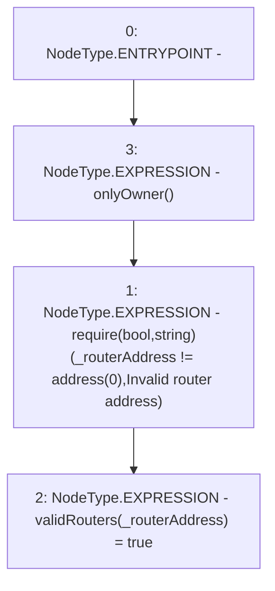

# Context: sYETITokenTester.addValidRouter

**Contract:** `sYETITokenTester` (Inherits: sYETIToken, BoringOwnable, BoringOwnableData, Domain, IERC20)
**Signature:** `addValidRouter(address)`
**Method Selector ID:** `0x8fb811ff`
**Visibility:** `external`
**Environment-Free:** `No (reads EVM state context)`
**Modifiers:**
- `onlyOwner`
  ```solidity
  modifier onlyOwner() {
          require(msg.sender == owner, "Ownable: caller is not the owner");
          _;
      }
  ```

### State Variables Interaction
- **Reads:** None
- **Writes:** validRouters

### Assertion Checks & Business Requirements
- require/assert: `require(bool,string)(_routerAddress != address(0),Invalid router address)`

### Environment & Verification Flags
- **Uses Foundry Cheatcodes:** No
- **Has Echidna Properties:** No

### Internal Calls Tree
- None

### External Calls / Value Transfers
- None

### Control Flow Graph (CFG)


### Source Mapping
Declared in: `certora-ac-datasets/detasets/web3bugs/dataset/web3bugs/66/packages/contracts/contracts/YETI/sYETIToken.sol` on lines **323** to **326**

```solidity
    function addValidRouter(address _routerAddress) external onlyOwner {
        require(_routerAddress != address(0), "Invalid router address");
        validRouters[_routerAddress] = true;
    }

```
