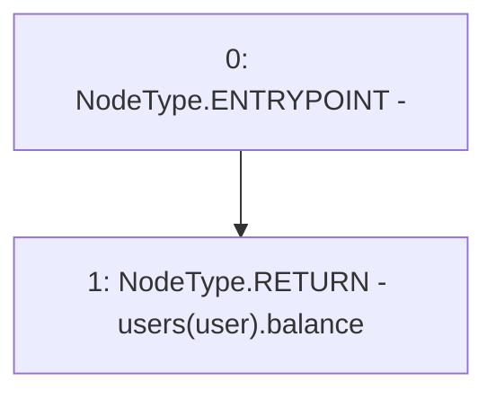

# Context: sYETITokenTester.balanceOf

**Contract:** `sYETITokenTester` (Inherits: sYETIToken, BoringOwnable, BoringOwnableData, Domain, IERC20)
**Signature:** `balanceOf(address) returns (uint256)`
**Method Selector ID:** `0x70a08231`
**Visibility:** `public`
**Environment-Free:** `Yes`
**Modifiers:** None

### State Variables Interaction
- **Reads:** users
- **Writes:** None

### Environment & Verification Flags
- **Uses Foundry Cheatcodes:** No
- **Has Echidna Properties:** No

### Internal Calls Tree
- None

### External Calls / Value Transfers
- None

### Control Flow Graph (CFG)


### Source Mapping
Declared in: `certora-ac-datasets/detasets/web3bugs/dataset/web3bugs/66/packages/contracts/contracts/YETI/sYETIToken.sol` on lines **70** to **72**

```solidity
    function balanceOf(address user) public view override returns (uint256) {
        return users[user].balance;
    }

```
