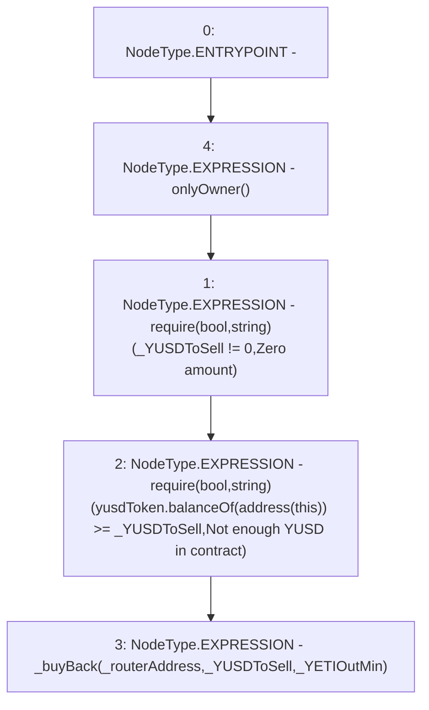

# Context: sYETITokenTester.buyBack

**Contract:** `sYETITokenTester` (Inherits: sYETIToken, BoringOwnable, BoringOwnableData, Domain, IERC20)
**Signature:** `buyBack(address,uint256,uint256)`
**Method Selector ID:** `0x8cbce621`
**Visibility:** `external`
**Environment-Free:** `No (reads EVM state context)`
**Modifiers:**
- `onlyOwner`
  ```solidity
  modifier onlyOwner() {
          require(msg.sender == owner, "Ownable: caller is not the owner");
          _;
      }
  ```

### State Variables Interaction
- **Reads:** yusdToken
- **Writes:** None

### Assertion Checks & Business Requirements
- require/assert: `require(bool,string)(_YUSDToSell != 0,Zero amount)`
- require/assert: `require(bool,string)(yusdToken.balanceOf(address(this)) >= _YUSDToSell,Not enough YUSD in contract)`

### Environment & Verification Flags
- **Uses Foundry Cheatcodes:** No
- **Has Echidna Properties:** No

### Internal Calls Tree
- None

### External Calls / Value Transfers
- `IERC20.TMP_72(uint256) = HIGH_LEVEL_CALL, dest:yusdToken(IERC20), function:balanceOf, arguments:['TMP_71']  `

### Control Flow Graph (CFG)


### Source Mapping
Declared in: `certora-ac-datasets/detasets/web3bugs/dataset/web3bugs/66/packages/contracts/contracts/YETI/sYETIToken.sol` on lines **246** to **250**

```solidity
    function buyBack(address _routerAddress, uint256 _YUSDToSell, uint256 _YETIOutMin) external onlyOwner {
        require(_YUSDToSell != 0, "Zero amount");
        require(yusdToken.balanceOf(address(this)) >= _YUSDToSell, "Not enough YUSD in contract");
        _buyBack(_routerAddress, _YUSDToSell, _YETIOutMin);
    }

```
