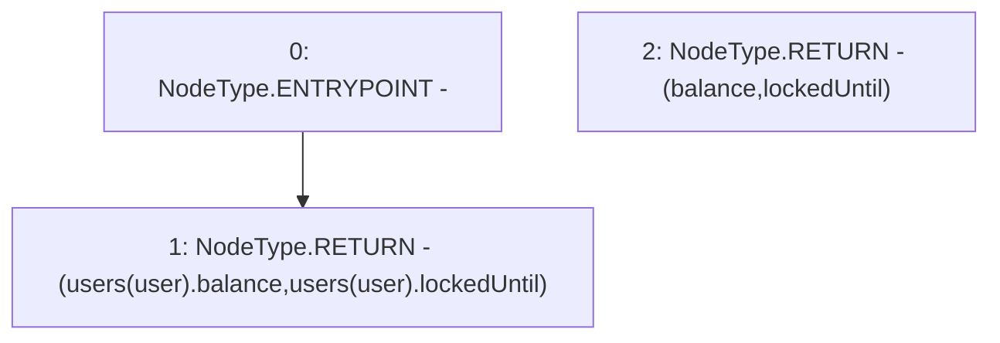

# Context: sYETITokenTester.getUserInfo

**Contract:** `sYETITokenTester` (Inherits: sYETIToken, BoringOwnable, BoringOwnableData, Domain, IERC20)
**Signature:** `getUserInfo(address) returns (uint128, uint128)`
**Method Selector ID:** `0x6386c1c7`
**Visibility:** `public`
**Environment-Free:** `Yes`
**Modifiers:** None

### State Variables Interaction
- **Reads:** users
- **Writes:** None

### Environment & Verification Flags
- **Uses Foundry Cheatcodes:** No
- **Has Echidna Properties:** No

### Internal Calls Tree
- None

### External Calls / Value Transfers
- None

### Control Flow Graph (CFG)


### Source Mapping
Declared in: `certora-ac-datasets/detasets/web3bugs/dataset/web3bugs/66/packages/contracts/contracts/TestContracts/sYETITokenTester.sol` on lines **9** to **11**

```solidity
  function getUserInfo(address user) public view returns (uint128 balance, uint128 lockedUntil) {
    return (users[user].balance, users[user].lockedUntil);
  }

```
