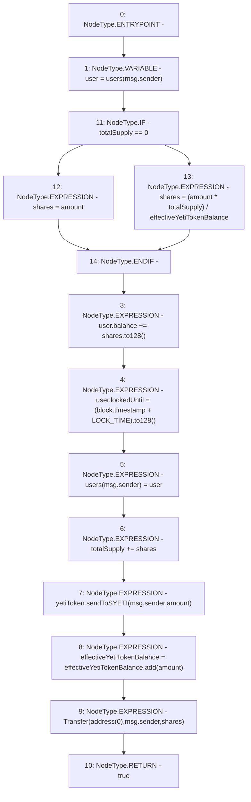

# Context: sYETITokenTester.mint

**Contract:** `sYETITokenTester` (Inherits: sYETIToken, BoringOwnable, BoringOwnableData, Domain, IERC20)
**Signature:** `mint(uint256) returns (bool)`
**Method Selector ID:** `0xa0712d68`
**Visibility:** `public`
**Environment-Free:** `No (reads EVM state context)`
**Modifiers:** None

### State Variables Interaction
- **Reads:** LOCK_TIME, effectiveYetiTokenBalance, totalSupply, users, yetiToken
- **Writes:** effectiveYetiTokenBalance, totalSupply, users

### Environment & Verification Flags
- **Uses Foundry Cheatcodes:** No
- **Has Echidna Properties:** No

### Internal Calls Tree
- None

### External Calls / Value Transfers
- `BoringMath.TMP_47(uint256) = LIBRARY_CALL, dest:BoringMath, function:BoringMath.add(uint256,uint256), arguments:['effectiveYetiTokenBalance', 'amount'] `
- `IYETIToken.HIGH_LEVEL_CALL, dest:yetiToken(IYETIToken), function:sendToSYETI, arguments:['msg.sender', 'amount']  `
- `BoringMath.TMP_43(uint128) = LIBRARY_CALL, dest:BoringMath, function:BoringMath.to128(uint256), arguments:['shares'] `
- `BoringMath.TMP_45(uint128) = LIBRARY_CALL, dest:BoringMath, function:BoringMath.to128(uint256), arguments:['TMP_44'] `

### Control Flow Graph (CFG)


### Source Mapping
Declared in: `certora-ac-datasets/detasets/web3bugs/dataset/web3bugs/66/packages/contracts/contracts/YETI/sYETIToken.sol` on lines **194** to **208**

```solidity
    function mint(uint256 amount) public returns (bool) {
        User memory user = users[msg.sender];

        uint256 shares = totalSupply == 0 ? amount : (amount * totalSupply) / effectiveYetiTokenBalance;
        user.balance += shares.to128();
        user.lockedUntil = (block.timestamp + LOCK_TIME).to128();
        users[msg.sender] = user;
        totalSupply += shares;

        yetiToken.sendToSYETI(msg.sender, amount);
        effectiveYetiTokenBalance = effectiveYetiTokenBalance.add(amount);

        emit Transfer(address(0), msg.sender, shares);
        return true;
    }

```
