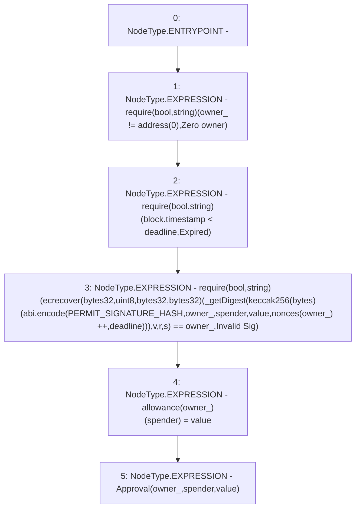

# Context: sYETITokenTester.permit

**Contract:** `sYETITokenTester` (Inherits: sYETIToken, BoringOwnable, BoringOwnableData, Domain, IERC20)
**Signature:** `permit(address,address,uint256,uint256,uint8,bytes32,bytes32)`
**Method Selector ID:** `0xd505accf`
**Visibility:** `external`
**Environment-Free:** `No (reads EVM state context)`
**Modifiers:** None

### State Variables Interaction
- **Reads:** PERMIT_SIGNATURE_HASH, nonces
- **Writes:** allowance, nonces

### Assertion Checks & Business Requirements
- require/assert: `require(bool,string)(owner_ != address(0),Zero owner)`
- require/assert: `require(bool,string)(block.timestamp < deadline,Expired)`
- require/assert: `require(bool,string)(ecrecover(bytes32,uint8,bytes32,bytes32)(_getDigest(keccak256(bytes)(abi.encode(PERMIT_SIGNATURE_HASH,owner_,spender,value,nonces[owner_] ++,deadline))),v,r,s) == owner_,Invalid Sig)`

### Environment & Verification Flags
- **Uses Foundry Cheatcodes:** No
- **Has Echidna Properties:** No

### Internal Calls Tree
- None

### External Calls / Value Transfers
- None

### Control Flow Graph (CFG)


### Source Mapping
Declared in: `certora-ac-datasets/detasets/web3bugs/dataset/web3bugs/66/packages/contracts/contracts/YETI/sYETIToken.sol` on lines **172** to **190**

```solidity
    function permit(
        address owner_,
        address spender,
        uint256 value,
        uint256 deadline,
        uint8 v,
        bytes32 r,
        bytes32 s
    ) external override {
        require(owner_ != address(0), "Zero owner");
        require(block.timestamp < deadline, "Expired");
        require(
            ecrecover(_getDigest(keccak256(abi.encode(PERMIT_SIGNATURE_HASH, owner_, spender, value, nonces[owner_]++, deadline))), v, r, s) ==
            owner_,
            "Invalid Sig"
        );
        allowance[owner_][spender] = value;
        emit Approval(owner_, spender, value);
    }

```
