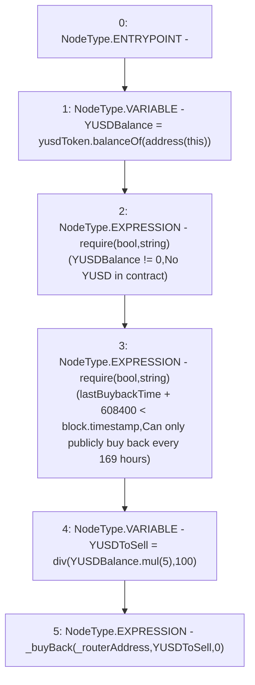

# Context: sYETITokenTester.publicBuyBack

**Contract:** `sYETITokenTester` (Inherits: sYETIToken, BoringOwnable, BoringOwnableData, Domain, IERC20)
**Signature:** `publicBuyBack(address)`
**Method Selector ID:** `0x3c613aee`
**Visibility:** `external`
**Environment-Free:** `No (reads EVM state context)`
**Modifiers:** None

### State Variables Interaction
- **Reads:** lastBuybackTime, yusdToken
- **Writes:** None

### Assertion Checks & Business Requirements
- require/assert: `require(bool,string)(YUSDBalance != 0,No YUSD in contract)`
- require/assert: `require(bool,string)(lastBuybackTime + 608400 < block.timestamp,Can only publicly buy back every 169 hours)`

### Environment & Verification Flags
- **Uses Foundry Cheatcodes:** No
- **Has Echidna Properties:** No

### Internal Calls Tree
- None

### External Calls / Value Transfers
- `BoringMath.TMP_84(uint256) = LIBRARY_CALL, dest:BoringMath, function:BoringMath.mul(uint256,uint256), arguments:['YUSDBalance', '5'] `
- `IERC20.TMP_78(uint256) = HIGH_LEVEL_CALL, dest:yusdToken(IERC20), function:balanceOf, arguments:['TMP_77']  `

### Control Flow Graph (CFG)


### Source Mapping
Declared in: `certora-ac-datasets/detasets/web3bugs/dataset/web3bugs/66/packages/contracts/contracts/YETI/sYETIToken.sol` on lines **258** to **266**

```solidity
    function publicBuyBack(address _routerAddress) external {
        uint256 YUSDBalance = yusdToken.balanceOf(address(this));
        require(YUSDBalance != 0, "No YUSD in contract");
        require(lastBuybackTime + 169 hours < block.timestamp, "Can only publicly buy back every 169 hours");
        // Get 5% of the YUSD in the contract
        // Always enough YUSD in the contract to cover the 5% of the YUSD in the contract
        uint256 YUSDToSell = div(YUSDBalance.mul(5), 100);
        _buyBack(_routerAddress, YUSDToSell, 0);
    }

```
