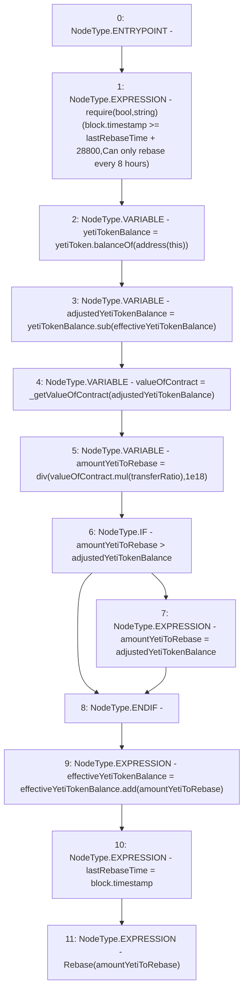

# Context: sYETITokenTester.rebase

**Contract:** `sYETITokenTester` (Inherits: sYETIToken, BoringOwnable, BoringOwnableData, Domain, IERC20)
**Signature:** `rebase()`
**Method Selector ID:** `0xaf14052c`
**Visibility:** `external`
**Environment-Free:** `No (reads EVM state context)`
**Modifiers:** None

### State Variables Interaction
- **Reads:** effectiveYetiTokenBalance, lastRebaseTime, transferRatio, yetiToken
- **Writes:** effectiveYetiTokenBalance, lastRebaseTime

### Assertion Checks & Business Requirements
- require/assert: `require(bool,string)(block.timestamp >= lastRebaseTime + 28800,Can only rebase every 8 hours)`

### Environment & Verification Flags
- **Uses Foundry Cheatcodes:** No
- **Has Echidna Properties:** No

### Internal Calls Tree
- None

### External Calls / Value Transfers
- `IYETIToken.TMP_103(uint256) = HIGH_LEVEL_CALL, dest:yetiToken(IYETIToken), function:balanceOf, arguments:['TMP_102']  `
- `BoringMath.TMP_106(uint256) = LIBRARY_CALL, dest:BoringMath, function:BoringMath.mul(uint256,uint256), arguments:['valueOfContract', 'transferRatio'] `
- `BoringMath.TMP_104(uint256) = LIBRARY_CALL, dest:BoringMath, function:BoringMath.sub(uint256,uint256), arguments:['yetiTokenBalance', 'effectiveYetiTokenBalance'] `
- `BoringMath.TMP_109(uint256) = LIBRARY_CALL, dest:BoringMath, function:BoringMath.add(uint256,uint256), arguments:['effectiveYetiTokenBalance', 'amountYetiToRebase'] `

### Control Flow Graph (CFG)


### Source Mapping
Declared in: `certora-ac-datasets/detasets/web3bugs/dataset/web3bugs/66/packages/contracts/contracts/YETI/sYETIToken.sol` on lines **282** to **305**

```solidity
    function rebase() external {
        require(block.timestamp >= lastRebaseTime + 8 hours, "Can only rebase every 8 hours");
        // Use last buyback price to transfer some of the actual YETI Tokens that this contract owns 
        // to the effective yeti token balance. Transfer a portion of the value over to the effective balance

        // raw balance of the contract
        uint256 yetiTokenBalance = yetiToken.balanceOf(address(this));  
        // amount of YETI free / available to give out
        uint256 adjustedYetiTokenBalance = yetiTokenBalance.sub(effectiveYetiTokenBalance); 
        // in YETI, amount that should be eligible to give out.
        uint256 valueOfContract = _getValueOfContract(adjustedYetiTokenBalance); 
        // in YETI, amount to rebase
        uint256 amountYetiToRebase = div(valueOfContract.mul(transferRatio), 1e18); 
        // Ensure that the amount of YETI tokens effectively added is >= the amount we have repurchased. 
        // Amount available = adjustdYetiTokenBalance, amount to distribute is amountYetiToRebase
        if (amountYetiToRebase > adjustedYetiTokenBalance) {
            amountYetiToRebase = adjustedYetiTokenBalance;
        }
        // rebase amount joins the effective supply. 
        effectiveYetiTokenBalance = effectiveYetiTokenBalance.add(amountYetiToRebase);
        // update rebase time
        lastRebaseTime = block.timestamp;
        emit Rebase(amountYetiToRebase);
    }

```
