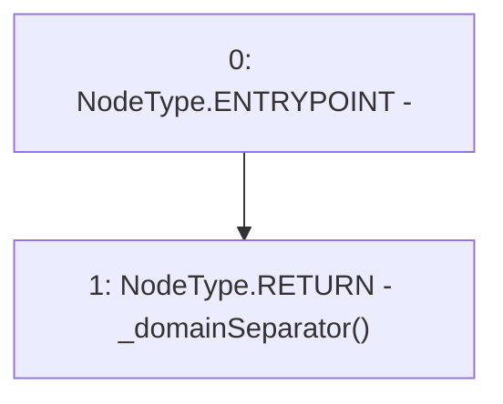

# Context: sYETIToken.DOMAIN_SEPARATOR

**Contract:** `sYETIToken` (Inherits: BoringOwnable, BoringOwnableData, Domain, IERC20)
**Signature:** `DOMAIN_SEPARATOR() returns (bytes32)`
**Method Selector ID:** `0x3644e515`
**Visibility:** `external`
**Environment-Free:** `Yes`
**Modifiers:** None

### State Variables Interaction
- **Reads:** None
- **Writes:** None

### Environment & Verification Flags
- **Uses Foundry Cheatcodes:** No
- **Has Echidna Properties:** No

### Internal Calls Tree
- None

### External Calls / Value Transfers
- None

### Control Flow Graph (CFG)


### Source Mapping
Declared in: `certora-ac-datasets/detasets/web3bugs/dataset/web3bugs/66/packages/contracts/contracts/YETI/sYETIToken.sol` on lines **160** to **162**

```solidity
    function DOMAIN_SEPARATOR() external view returns (bytes32) {
        return _domainSeparator();
    }

```
