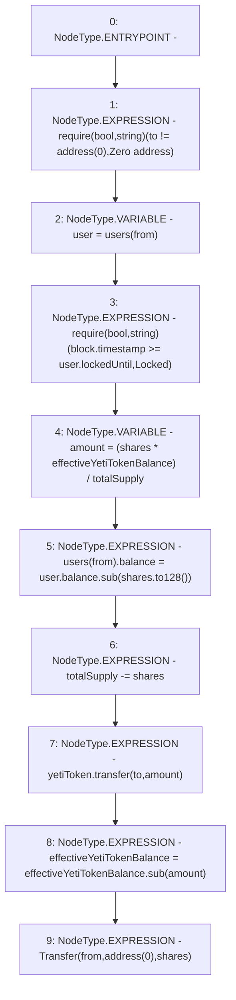

# Context: sYETIToken._burn

**Contract:** `sYETIToken` (Inherits: BoringOwnable, BoringOwnableData, Domain, IERC20)
**Signature:** `_burn(address,address,uint256)`
**Method Selector ID:** `Internal (No Method ID)`
**Visibility:** `internal`
**Environment-Free:** `No (reads EVM state context)`
**Modifiers:** None

### State Variables Interaction
- **Reads:** effectiveYetiTokenBalance, totalSupply, users, yetiToken
- **Writes:** effectiveYetiTokenBalance, totalSupply, users

### Assertion Checks & Business Requirements
- require/assert: `require(bool,string)(to != address(0),Zero address)`
- require/assert: `require(bool,string)(block.timestamp >= user.lockedUntil,Locked)`

### Environment & Verification Flags
- **Uses Foundry Cheatcodes:** No
- **Has Echidna Properties:** No

### Internal Calls Tree
- None

### External Calls / Value Transfers
- `IYETIToken.TMP_316(bool) = HIGH_LEVEL_CALL, dest:yetiToken(IYETIToken), function:transfer, arguments:['to', 'amount']  `
- `BoringMath.TMP_314(uint128) = LIBRARY_CALL, dest:BoringMath, function:BoringMath.to128(uint256), arguments:['shares'] `
- `BoringMath.TMP_317(uint256) = LIBRARY_CALL, dest:BoringMath, function:BoringMath.sub(uint256,uint256), arguments:['effectiveYetiTokenBalance', 'amount'] `
- `BoringMath128.TMP_315(uint128) = LIBRARY_CALL, dest:BoringMath128, function:BoringMath128.sub(uint128,uint128), arguments:['REF_111', 'TMP_314'] `

### Control Flow Graph (CFG)


### Source Mapping
Declared in: `certora-ac-datasets/detasets/web3bugs/dataset/web3bugs/66/packages/contracts/contracts/YETI/sYETIToken.sol` on lines **210** to **226**

```solidity
    function _burn(
        address from,
        address to,
        uint256 shares
    ) internal {
        require(to != address(0), "Zero address");
        User memory user = users[from];
        require(block.timestamp >= user.lockedUntil, "Locked");
        uint256 amount = (shares * effectiveYetiTokenBalance) / totalSupply;
        users[from].balance = user.balance.sub(shares.to128()); // Must check underflow
        totalSupply -= shares;

        yetiToken.transfer(to, amount);
        effectiveYetiTokenBalance = effectiveYetiTokenBalance.sub(amount);

        emit Transfer(from, address(0), shares);
    }

```
