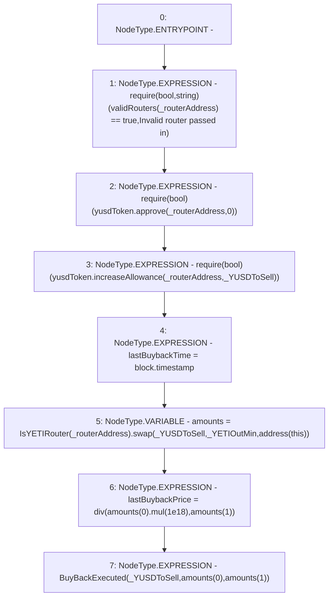

# Context: sYETIToken._buyBack

**Contract:** `sYETIToken` (Inherits: BoringOwnable, BoringOwnableData, Domain, IERC20)
**Signature:** `_buyBack(address,uint256,uint256)`
**Method Selector ID:** `Internal (No Method ID)`
**Visibility:** `internal`
**Environment-Free:** `No (reads EVM state context)`
**Modifiers:** None

### State Variables Interaction
- **Reads:** validRouters, yusdToken
- **Writes:** lastBuybackPrice, lastBuybackTime

### Assertion Checks & Business Requirements
- require/assert: `require(bool,string)(validRouters[_routerAddress] == true,Invalid router passed in)`
- require/assert: `require(bool)(yusdToken.approve(_routerAddress,0))`
- require/assert: `require(bool)(yusdToken.increaseAllowance(_routerAddress,_YUSDToSell))`

### Environment & Verification Flags
- **Uses Foundry Cheatcodes:** No
- **Has Echidna Properties:** No

### Internal Calls Tree
- None

### External Calls / Value Transfers
- `IsYETIRouter.TMP_349(uint256[]) = HIGH_LEVEL_CALL, dest:TMP_347(IsYETIRouter), function:swap, arguments:['_YUSDToSell', '_YETIOutMin', 'TMP_348']  `
- `BoringMath.TMP_350(uint256) = LIBRARY_CALL, dest:BoringMath, function:BoringMath.mul(uint256,uint256), arguments:['REF_123', '1000000000000000000'] `
- `IERC20.TMP_343(bool) = HIGH_LEVEL_CALL, dest:yusdToken(IERC20), function:approve, arguments:['_routerAddress', '0']  `
- `IERC20.TMP_345(bool) = HIGH_LEVEL_CALL, dest:yusdToken(IERC20), function:increaseAllowance, arguments:['_routerAddress', '_YUSDToSell']  `

### Control Flow Graph (CFG)


### Source Mapping
Declared in: `certora-ac-datasets/detasets/web3bugs/dataset/web3bugs/66/packages/contracts/contracts/YETI/sYETIToken.sol` on lines **269** to **279**

```solidity
    function _buyBack(address _routerAddress, uint256 _YUSDToSell, uint256 _YETIOutMin) internal {
        // Checks internal mapping to see if router is valid
        require(validRouters[_routerAddress] == true, "Invalid router passed in");
        require(yusdToken.approve(_routerAddress, 0));
        require(yusdToken.increaseAllowance(_routerAddress, _YUSDToSell));
        lastBuybackTime = block.timestamp;
        uint256[] memory amounts = IsYETIRouter(_routerAddress).swap(_YUSDToSell, _YETIOutMin, address(this));
        // amounts[0] is the amount of YUSD that was sold, and amounts[1] is the amount of YETI that was gained in return. So the price is amounts[0] / amounts[1]
        lastBuybackPrice = div(amounts[0].mul(1e18), amounts[1]);
        emit BuyBackExecuted(_YUSDToSell, amounts[0], amounts[1]);
    }

```
