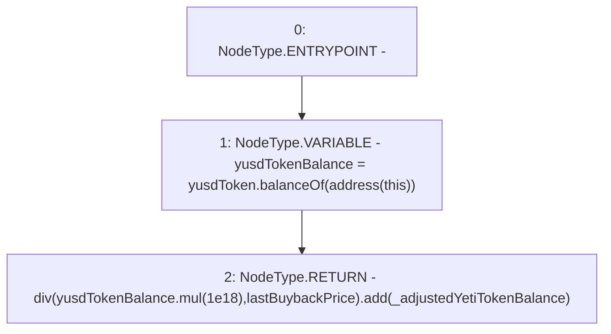

# Context: sYETIToken._getValueOfContract

**Contract:** `sYETIToken` (Inherits: BoringOwnable, BoringOwnableData, Domain, IERC20)
**Signature:** `_getValueOfContract(uint256) returns (uint256)`
**Method Selector ID:** `Internal (No Method ID)`
**Visibility:** `internal`
**Environment-Free:** `Yes`
**Modifiers:** None

### State Variables Interaction
- **Reads:** lastBuybackPrice, yusdToken
- **Writes:** None

### Environment & Verification Flags
- **Uses Foundry Cheatcodes:** No
- **Has Echidna Properties:** No

### Internal Calls Tree
- None

### External Calls / Value Transfers
- `IERC20.TMP_366(uint256) = HIGH_LEVEL_CALL, dest:yusdToken(IERC20), function:balanceOf, arguments:['TMP_365']  `
- `BoringMath.TMP_367(uint256) = LIBRARY_CALL, dest:BoringMath, function:BoringMath.mul(uint256,uint256), arguments:['yusdTokenBalance', '1000000000000000000'] `
- `BoringMath.TMP_369(uint256) = LIBRARY_CALL, dest:BoringMath, function:BoringMath.add(uint256,uint256), arguments:['TMP_368', '_adjustedYetiTokenBalance'] `

### Control Flow Graph (CFG)


### Source Mapping
Declared in: `certora-ac-datasets/detasets/web3bugs/dataset/web3bugs/66/packages/contracts/contracts/YETI/sYETIToken.sol` on lines **310** to **313**

```solidity
    function _getValueOfContract(uint _adjustedYetiTokenBalance) internal view returns (uint256) {
        uint256 yusdTokenBalance = yusdToken.balanceOf(address(this));
        return div(yusdTokenBalance.mul(1e18), lastBuybackPrice).add(_adjustedYetiTokenBalance);
    }

```
