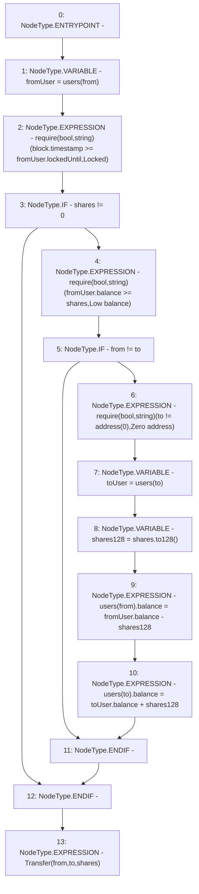

# Context: sYETIToken._transfer

**Contract:** `sYETIToken` (Inherits: BoringOwnable, BoringOwnableData, Domain, IERC20)
**Signature:** `_transfer(address,address,uint256)`
**Method Selector ID:** `Internal (No Method ID)`
**Visibility:** `internal`
**Environment-Free:** `No (reads EVM state context)`
**Modifiers:** None

### State Variables Interaction
- **Reads:** users
- **Writes:** users

### Assertion Checks & Business Requirements
- require/assert: `require(bool,string)(block.timestamp >= fromUser.lockedUntil,Locked)`
- require/assert: `require(bool,string)(fromUser.balance >= shares,Low balance)`
- require/assert: `require(bool,string)(to != address(0),Zero address)`

### Environment & Verification Flags
- **Uses Foundry Cheatcodes:** No
- **Has Echidna Properties:** No

### Internal Calls Tree
- None

### External Calls / Value Transfers
- `BoringMath.TMP_266(uint128) = LIBRARY_CALL, dest:BoringMath, function:BoringMath.to128(uint256), arguments:['shares'] `

### Control Flow Graph (CFG)


### Source Mapping
Declared in: `certora-ac-datasets/detasets/web3bugs/dataset/web3bugs/66/packages/contracts/contracts/YETI/sYETIToken.sol` on lines **81** to **99**

```solidity
    function _transfer(
        address from,
        address to,
        uint256 shares
    ) internal {
        User memory fromUser = users[from];
        require(block.timestamp >= fromUser.lockedUntil, "Locked");
        if (shares != 0) {
            require(fromUser.balance >= shares, "Low balance");
            if (from != to) {
                require(to != address(0), "Zero address"); // Moved down so other failed calls safe some gas
                User memory toUser = users[to];
                uint128 shares128 = shares.to128();
                users[from].balance = fromUser.balance - shares128; // Underflow is checked
                users[to].balance = toUser.balance + shares128; // Can't overflow because totalSupply would be greater than 2^128-1;
            }
        }
        emit Transfer(from, to, shares);
    }

```
