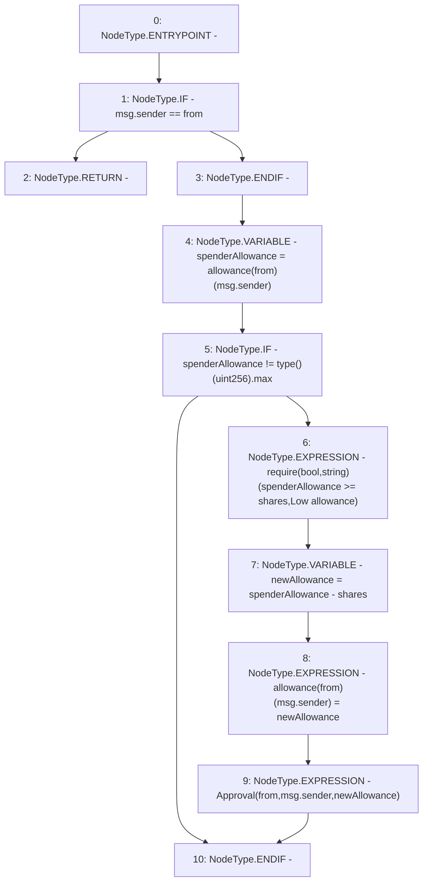

# Context: sYETIToken._useAllowance

**Contract:** `sYETIToken` (Inherits: BoringOwnable, BoringOwnableData, Domain, IERC20)
**Signature:** `_useAllowance(address,uint256)`
**Method Selector ID:** `Internal (No Method ID)`
**Visibility:** `internal`
**Environment-Free:** `No (reads EVM state context)`
**Modifiers:** None

### State Variables Interaction
- **Reads:** allowance
- **Writes:** allowance

### Assertion Checks & Business Requirements
- require/assert: `require(bool,string)(spenderAllowance >= shares,Low allowance)`

### Environment & Verification Flags
- **Uses Foundry Cheatcodes:** No
- **Has Echidna Properties:** No

### Internal Calls Tree
- None

### External Calls / Value Transfers
- None

### Control Flow Graph (CFG)


### Source Mapping
Declared in: `certora-ac-datasets/detasets/web3bugs/dataset/web3bugs/66/packages/contracts/contracts/YETI/sYETIToken.sol` on lines **101** to **113**

```solidity
    function _useAllowance(address from, uint256 shares) internal {
        if (msg.sender == from) {
            return;
        }
        uint256 spenderAllowance = allowance[from][msg.sender];
        // If allowance is infinite, don't decrease it to save on gas (breaks with EIP-20).
        if (spenderAllowance != type(uint256).max) {
            require(spenderAllowance >= shares, "Low allowance");
            uint256 newAllowance = spenderAllowance - shares;
            allowance[from][msg.sender] = newAllowance; // Underflow is checked
            emit Approval(from, msg.sender, newAllowance);
        }
    }

```
