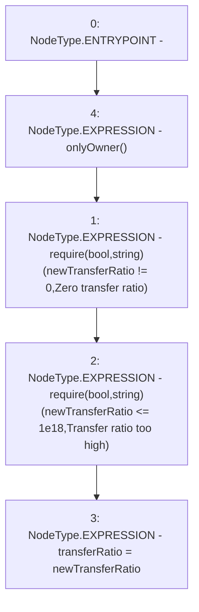

# Context: sYETIToken.setTransferRatio

**Contract:** `sYETIToken` (Inherits: BoringOwnable, BoringOwnableData, Domain, IERC20)
**Signature:** `setTransferRatio(uint256)`
**Method Selector ID:** `0xdd225d77`
**Visibility:** `external`
**Environment-Free:** `No (reads EVM state context)`
**Modifiers:**
- `onlyOwner`
  ```solidity
  modifier onlyOwner() {
          require(msg.sender == owner, "Ownable: caller is not the owner");
          _;
      }
  ```

### State Variables Interaction
- **Reads:** None
- **Writes:** transferRatio

### Assertion Checks & Business Requirements
- require/assert: `require(bool,string)(newTransferRatio != 0,Zero transfer ratio)`
- require/assert: `require(bool,string)(newTransferRatio <= 1e18,Transfer ratio too high)`

### Environment & Verification Flags
- **Uses Foundry Cheatcodes:** No
- **Has Echidna Properties:** No

### Internal Calls Tree
- None

### External Calls / Value Transfers
- `TMP_371(None) = SOLIDITY_CALL require(bool,string)(TMP_370,Zero transfer ratio)`

### Control Flow Graph (CFG)


### Source Mapping
Declared in: `certora-ac-datasets/detasets/web3bugs/dataset/web3bugs/66/packages/contracts/contracts/YETI/sYETIToken.sol` on lines **316** to **320**

```solidity
    function setTransferRatio(uint256 newTransferRatio) external onlyOwner {
        require(newTransferRatio != 0, "Zero transfer ratio");
        require(newTransferRatio <= 1e18, "Transfer ratio too high");
        transferRatio = newTransferRatio;
    }

```
