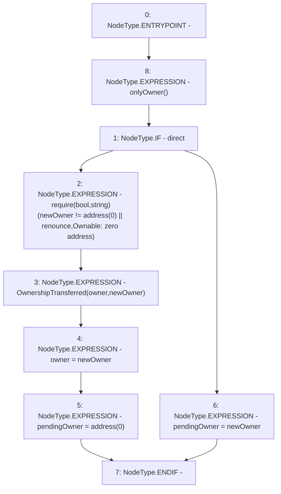

# Context: sYETIToken.transferOwnership

**Contract:** `sYETIToken` (Inherits: BoringOwnable, BoringOwnableData, Domain, IERC20)
**Signature:** `transferOwnership(address,bool,bool)`
**Method Selector ID:** `0x078dfbe7`
**Visibility:** `public`
**Environment-Free:** `No (reads EVM state context)`
**Modifiers:**
- `onlyOwner`
  ```solidity
  modifier onlyOwner() {
          require(msg.sender == owner, "Ownable: caller is not the owner");
          _;
      }
  ```

### State Variables Interaction
- **Reads:** owner
- **Writes:** owner, pendingOwner

### Assertion Checks & Business Requirements
- require/assert: `require(bool,string)(newOwner != address(0) || renounce,Ownable: zero address)`

### Environment & Verification Flags
- **Uses Foundry Cheatcodes:** No
- **Has Echidna Properties:** No

### Internal Calls Tree
- None

### External Calls / Value Transfers
- None

### Control Flow Graph (CFG)


### Source Mapping
Declared in: `certora-ac-datasets/detasets/web3bugs/dataset/web3bugs/66/packages/contracts/contracts/YETI/BoringCrypto/BoringOwnable.sol` on lines **27** to **44**

```solidity
    function transferOwnership(
        address newOwner,
        bool direct,
        bool renounce
    ) public onlyOwner {
        if (direct) {
            // Checks
            require(newOwner != address(0) || renounce, "Ownable: zero address");

            // Effects
            emit OwnershipTransferred(owner, newOwner);
            owner = newOwner;
            pendingOwner = address(0);
        } else {
            // Effects
            pendingOwner = newOwner;
        }
    }

```
